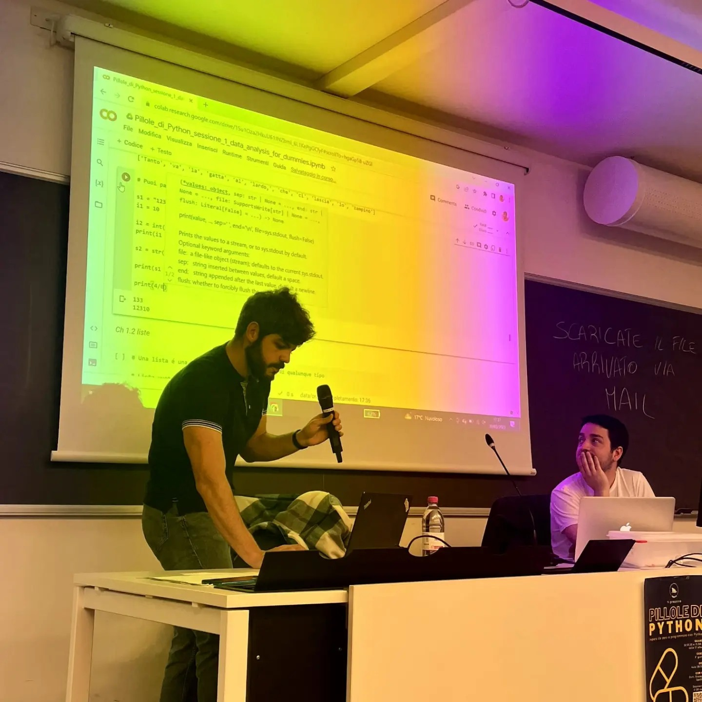

2 hours seminar for non-computer scientists, introducing them to Python programming for the first time. The seminar focused on Python basics and manipulation of data using pandas. Event sponsored by University of Trento

